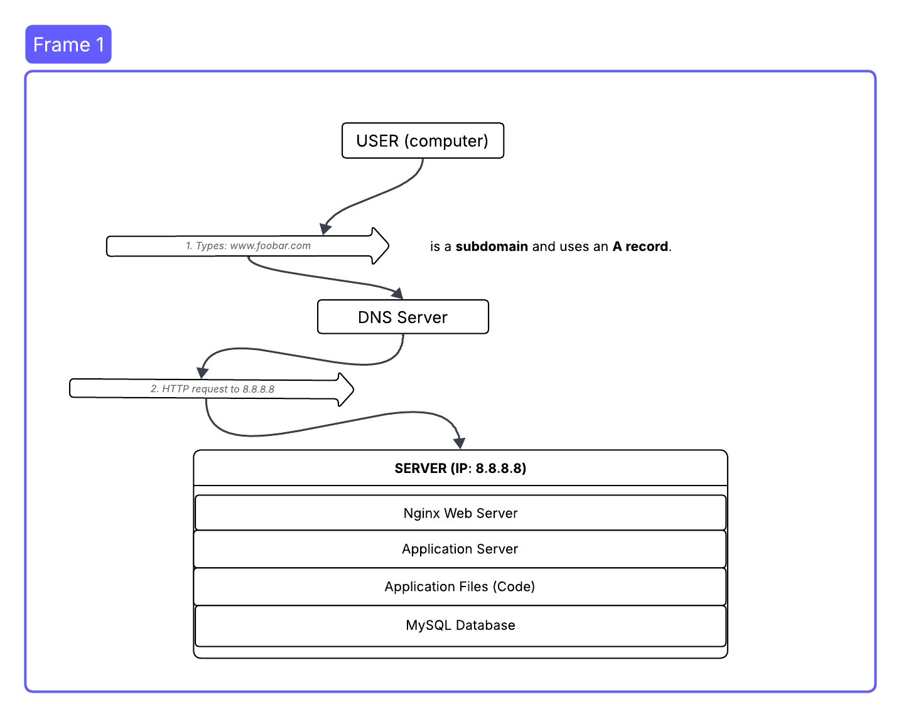
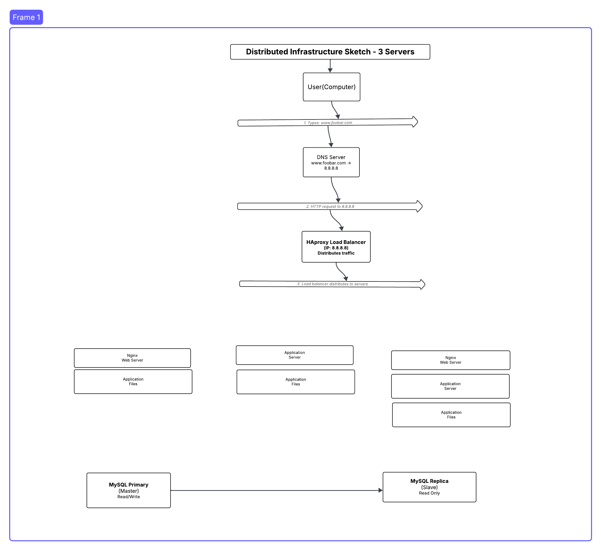
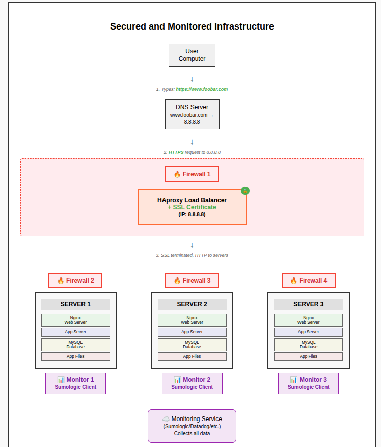

# Task 0: Simple Web Stack

This task involves designing a basic web infrastructure on a single server with a LAMP-like stack. Below is a breakdown of the key concepts and limitations of such an architecture.


---


## 🧠 Conceptual Explanations

### 🖥️ What is a Server?
A **server** is a powerful computer designed to provide services or resources to other devices (clients) over a network. In this context, it runs the **web**, **application**, and **database** layers of the website.

---

### 🌍 What is the Role of the Domain Name?
The **domain name** (e.g., `foobar.com`) maps human-readable names to IP addresses (like `8.8.8.8`), so users don't have to remember numbers. It allows access to the website through a simple name instead of an IP address.

---

### 📛 What Type of DNS Record is `www` in `www.foobar.com`?
The `www` part is a **subdomain**, and its DNS record is typically an **A (Address) Record**, which maps it to the server's IP address (`8.8.8.8`).

---

### 🌐 What is the Role of the Web Server (Nginx)?
**Nginx** handles **HTTP(S)** requests from clients. It serves static files (HTML, CSS, images) and forwards dynamic requests to the application server.

---

### ⚙️ What is the Role of the Application Server?
The **application server** (e.g., PHP, Node.js) runs the **backend logic** of your website, such as user authentication, data processing, and interaction with the database.

---

### 🗃️ What is the Role of the Database?
The **MySQL database** stores structured data such as user accounts, posts, and transactions. The application server queries it to retrieve or modify data.

---

### 📡 How Does the Server Communicate with the User’s Computer?
Communication happens over **HTTP/HTTPS protocols**, using **TCP/IP** as the underlying transport layer. Nginx listens on port **80 (HTTP)** or **443 (HTTPS)** for incoming traffic.

---

## ⚠️ Weaknesses of This Infrastructure

1. **SPOF (Single Point of Failure)**  
   If the only server fails, everything goes down — the site becomes inaccessible.

2. **Downtime During Maintenance**  
   Restarting services like Nginx or deploying new code results in temporary service unavailability.

3. **Scalability Issues**  
   The setup cannot handle large volumes of traffic easily — the single server has limited CPU, RAM, and network capacity.

---

# Task 1: Distributed Web Infrastructure

This task involves designing a three-server infrastructure to host `www.foobar.com`, focusing on load balancing, redundancy, and availability.


---

## 🧠 Conceptual Explanations

### 🔧 Why Each Element is Added

- **HAProxy Load Balancer**  
  Distributes user requests across multiple servers to reduce load and ensure redundancy.

- **2 Web/App Servers**  
  Ensure high availability. If one fails, the other continues serving requests without downtime.

- **One Shared Codebase**  
  Keeps both servers in sync to provide consistent application behavior and updates.

- **Single MySQL Database**  
  Central data store accessed by both application servers for persistence and data sharing.

---

### 🔁 Load Balancer Algorithm

- **Round Robin**  
  A simple algorithm that evenly distributes incoming requests in a cyclical order:  
  `Server A → Server B → Server A → …`  
  Effective when the backend servers have similar capacities and workloads.

---

### 🔄 Active-Active vs Active-Passive

- **Active-Active**  
  All backend servers process traffic concurrently.  
  _This is our setup_: both Web/App servers are live, and HAProxy distributes traffic between them.

- **Active-Passive**  
  One server is active, while the other stays idle as a backup.  
  It only takes over when the active server fails.

---

### 🧬 Primary-Replica (Master-Slave) Database Cluster

> _(Optional in this task, but worth understanding)_

- The **Primary** node handles **all writes** and can serve reads.
- The **Replica(s)** only serve **read queries**, and they **synchronize data** from the Primary node.
- Improves **performance** and provides **redundancy** in case of Primary failure (with additional failover setup).
  
In practice:
- Your application **writes to the Primary**.
- It may **read from either** if load distribution for reads is configured.

---

## ⚠️ Weaknesses in This Infrastructure

1. **Single Points of Failure (SPOFs)**  
   - **HAProxy Load Balancer**: If it fails, the entire system becomes unreachable.  
   - **MySQL Database**: No redundancy; failure results in data inaccessibility.

2. **Security Issues**  
   - **No HTTPS**: All communications are unencrypted and vulnerable to interception.  
   - **No Firewall**: System is exposed to attacks, port scanning, and brute force attempts.

3. **Lack of Monitoring**  
   - No visibility into uptime, response times, or failure detection.  
   - No alerts, health checks, or logs to proactively resolve issues.

---

# Task 2: Secured and Monitored Web Infrastructure

This task extends the distributed infrastructure by implementing critical security and monitoring components to protect the system and track performance.

---

## 🔐 Security Enhancements

### ✅ HTTPS (SSL/TLS)
- **Purpose**: Encrypts communication between the user and the web infrastructure.
- **Implementation**:
  - SSL certificates are configured at the **HAProxy Load Balancer**, enabling HTTPS on port **443**.
  - Traffic between user and load balancer is encrypted, ensuring data confidentiality and integrity.

### ✅ Firewall
- **Purpose**: Filters network traffic and prevents unauthorized access.
- **Implementation**:
  - A **firewall is positioned in front of the load balancer**, allowing only:
    - Port **443** (HTTPS)
    - Optionally, port **22** (SSH) for administration (restricted to specific IPs)
  - Further firewalls can be configured between the load balancer and internal servers to limit internal exposure.

---

## 📈 Monitoring Enhancements

### ✅ Monitoring System (e.g., Collectd, Prometheus, Nagios)
- **Purpose**: Provides visibility into system performance and health.
- **Implementation**:
  - Monitoring agents are installed on:
    - Web/App Servers
    - Load Balancer
    - MySQL Database Server
  - Metrics collected include:
    - **CPU usage**
    - **RAM utilization**
    - **Disk space**
    - **Server uptime**
    - **Request rate**
  - Alerts can be configured to notify admins on thresholds or server failure.

---

## 🧠 Why These Are Critical

| Component   | Problem Solved                             | Benefits                                     |
|-------------|---------------------------------------------|----------------------------------------------|
| HTTPS       | Prevents data interception (MITM attacks)   | Encrypts user data, boosts trust             |
| Firewall    | Exposes only necessary ports/services       | Minimizes attack surface                     |
| Monitoring  | Lack of visibility, slow response to issues | Enables proactive maintenance and scaling    |

---

## ⚠️ Remaining Issues (To Be Addressed Later)

- **No Load Balancer Redundancy**: Still a single point of failure.
- **No Database Replication**: MySQL is a SPOF unless configured as Primary-Replica.
- **No Logging System**: No centralized logs for debugging or audit.

---

## 📷 Architecture Diagram

> *(Insert image link once hosted on Imgur or other service)*

```markdown

